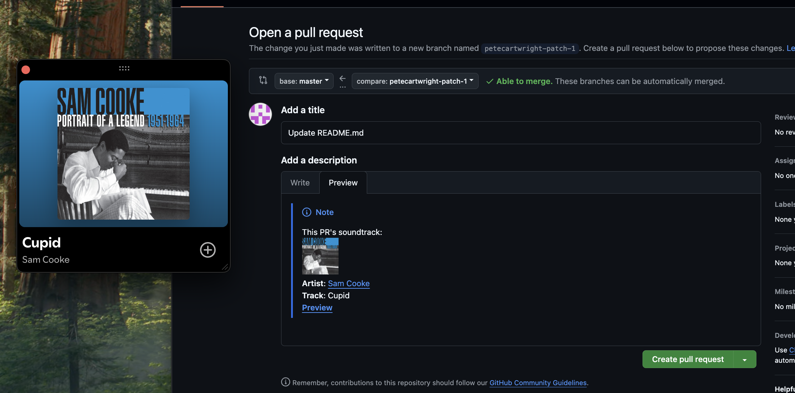

# spotify-to-pr

Lil Chrome extension to put what you're listening to on Spotify into your GitHub PR description.

Maybe you want to remember what you were listening to when you come back to debug. Maybe you want to enhance the general vibes of a PR. Maybe you want to impress your coworkers with your deep cuts.

Maybe you just like the little pictures?

## Installation

This isn't on the Chrome Web Store (and probably never will be) so you'll need to install it yourself.

1. Register for a Spotify Web API Client ID [here](https://developer.spotify.com/documentation/web-api)
2. Clone this repo, run `npm i` and `npm run build`
3. Install the extension:
   1. Go to `chrome://extensions` in your browser.
   2. Turn on "Developer Mode" via the toggle
   3. Click "Load Unpacked" and point it at the `/dist` directory that you built in step 2

## Usage

When you have a GitHub PR comment box open, click on the extension icon. If you haven't used it before, you'll have to authenticate with Spotify first.

Then click "Write to PR" to grab the song or podcast you're listening to and write it to your PR comment.

If there's already a song in there, it will replace it for you.
